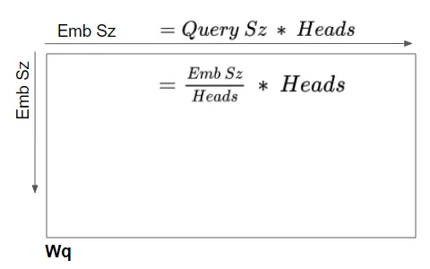
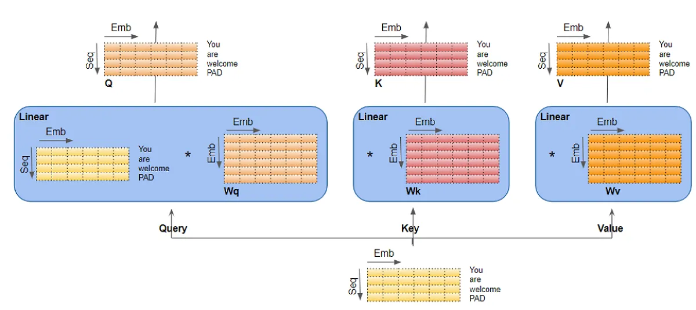
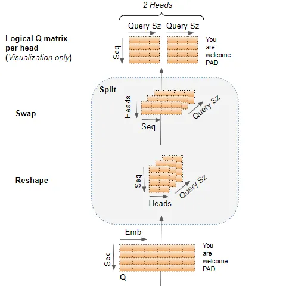
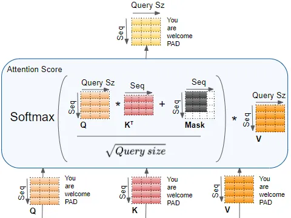
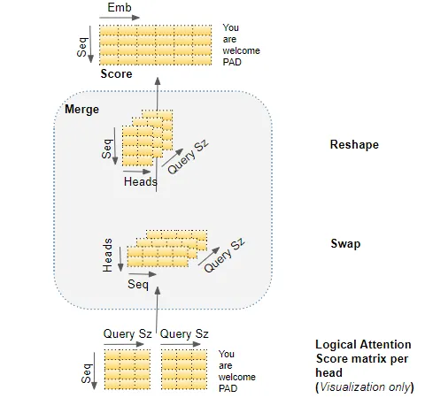
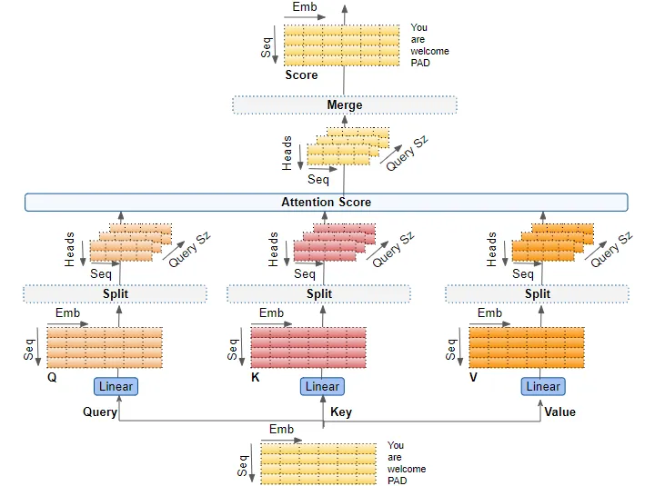
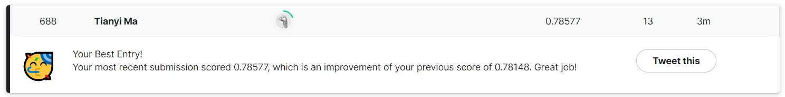

## Background

Twitter has become an important communication channel in times of emergency.

The ubiquitousness of smartphones enables people to announce an emergency they’re observing in real-time. Because of this, more agencies are interested in programatically monitoring Twitter (i.e. disaster relief organizations and news agencies).

But, it’s not always clear whether a person’s words are actually announcing a disaster. Take this example:

The author explicitly uses the word “ABLAZE” but means it metaphorically. This is clear to a human right away, especially with the visual aid. But it’s less clear to a machine.

In this competition, we’re challenged to build a machine learning model that predicts which Tweets are about real disasters and which one’s aren’t.

## Motivation

I have always know various ML NLP algorithms, but haven't used them in a real dataset outside of a classroom setting. When I saw this competition in Kaggle, I thought it would be a great opportunity for me to read the original paper and online resources about and deepen my understanding of the model behind recent LLM(Large Language Model), Tranformer, and learn to implement and customize it for this specific task.

## How Transformer Works

For this competition, I started by researching and understanding the details of the Transformer architecture. The most important component of this architecture is the multi-head attention mechanism.

### What is the attention mechanism and how it's used in Transformer

The attention mechanism takes its input in the form of three parameters, known as Query(Q), Key(K) and Value(V). They come in the format of matrices with dimensions $Embed_size \times Embed_size$. The Transformer model uses three kinds of attention mechanisms:

1. Self-attention in the Encoder — the input sequence pays attention to itself
2. Self-attention in the Decoder — the target sequence pays attention to itself
3. Encoder-Decoder-attention in the Decoder — the target sequence pays attention to the input sequence

The main idea of Query, Key and Value is drawn from informtation retrieval. For example, if you are searching for YouTube videos, and put in a few key words(Q), the search engine look for similar tag words(K), and return videos(V) associated with those tags. The three attention parameter matrices: Query, Key and Value, are the backbone of the attention mechanism. Remember the big three!

### Self-attention in the Encoder

First, each input sequence is converted to an input embedding and a positional embedding. Combining these two embeddings creates a vector representation of the sequence that captures the semantic and positional meaning of the sequence. Then, this vector representation is fed into all three of the attention parameter matrices, Query, Key and Value for the first self-attention block -- $W_{q}$, $W_{k}$ and $W_{v}$, and produces a new encoded representation which now incorporates the attention scores of the first self-attention block for each word in the sequence. Passing through the rest of the self-attention blocks in the Encoder, each of the blocks adds their own attention scores for each words as well.

### Self-attention in the Decoder

Same process as self-attention in the Encoder, except in training phase we process the target sequence same as the input sequence and feed that into all three attention parameter matrices. In inference phase, we start out by feeding the start of sentence token into the attention blocks and generate the next words repeatedly.

### Encoder-Decoder-attention in the Decoder

Same thing except the output of the encoder is fed into the Key and Value parameter matrices, and the output from the last self-attention block in the decoder is fed into the Query parameter matrix. The encoder-decoder-attention thus get a representation that captures the influence of both of the target and input sequence. More specifically, it gets the attention score of each of the target sequence representation words influenced by the attention scores, semantic and positional meanings of the input sequence words.

As the data flows through self-attention and encoder-Decoder-attention blocks in the Decoder, each block adds their attention scores to the output representation.

### The "Multi-head" Attention

When the attention mechanism uses multiple heads, it means that the three attention parameter matrices in each attention block are each sliced into N smaller matrices with the same dimention $Embed_size \times (\dfrac{Embed_size}{N})$. In reality, the matrices are not actually decoupled into N different matrices, but conceptually different heads compute in different sections of the matrix and encode multiple relationships and aspects for each word. So the parameter martices $W_q, W_k, and W_v$ will look like this:

Notice the relationship between $Embed_size, Query_size and Number of Attention Heads N$ is $Query_size = \dfrac{Embed_size}{N}$

### What exactly happens inside the attention blocks?

The three attention parameter matrices are linear layers. In the encoder self-attention blocks, the input sequence is processed and passed through these linear layers to produce the Q, K, and V matrices, like so:

The Q, K, and V matrices output by the linear layers are reshaped to include an explicit Head dimension. After then swaping the Head and Sequence dimention, we can now logically seperate the matrix into N Q matrices, one for each head.

The complete attention score then can be calculated in the Encoder self-attention:

It first multiplie %Q% with $K^{T}$, and then apply a mask of dimention $(seq - 1) \times (seq - 1)$ in order to mask out the padding word. It then applies a softmax to the matrix multiplication result divided by $\sqrt{Query_size}$, and multiply $V$ with the result as the final attention score.

Finally, we reshape the attention scores for all attention heads by basically reversing the reshaping process we've done before. This effectively merges all attention scores together and getting the encoded representation that captures the attention scores, semantic and positional meaning of the words.

Putting it together, this is the complete workflow of the multi-headed attention block.

The decoder self-attention and encoder-decoder-attention blocks are the same except with differently-shaped attention masks to mask out the padding token.

## The Program

Once I felt like I understood how Transformer works, I just want to test it out and see it in action. First we need to do some simple exploratory analysis and preprocessing, but I want to minimize this and get to the training stage quickly. I took a look at some of the tweets, and processed them by concatenating the location and keyword attribute in the end of the sentence. There are so many more ways I can preprocess the data better, including stripping stop words, numbers, HTML tags, punctuations and others, and converting to lower case. I left it as it is for now.

Then I mostly followed [this amazing tutorial](https://blog.paperspace.com/transformers-text-classification/) to implement a pre-trained Transformer model. The challenge is to customize the code to this use case. The first difference is the data source. In the tutorial the author imported data from the tfds library, which I think is a variation of Dataset type in Tensorflow that is not directly accessible and need to use library functions like `next()` and `batch()`, where as my data is a dataframe loaded from csv. I have to figure out the correct way to convert a dataframe to the correct Dataset type, which took me relatively a long time to solve. Moreover, the conversion needs to happen not only to the training dataset, but also to the testing dataset. Thus, when predicting, I called `model.predict(test_data.batch(1))` instead of `model.predict(test_data)`, which is a little ugly but get the work done. Finally, a sigmoid function is applied to the predictions, so that the predictions falls between 0 and 1 and rounded up or down to a binary result as the final classification.

## Result

Without any further customized fine-tuning and data preprocessing, the model acheived an accuracy score of 0.75758 on the test dataset. In the training set, according to the numbers, the expected accuracy of a random classifier would be around half and half. So my classifier is much better than the random classifier to predict correctly.

## Future Steps

I want to work on it a bit more in the future to explore text data preparation and handmaking a Transformer model. Following a different section of the above mentioned article and other notebooks should serve as a good first step. Besides, I also want to try fine-tuning the model, see how different hyperparameters affect the model accuracy, and how other training strategies like using 5-fold Stratified Cross Validation to affect the model outcome. In [the next article](/pages/article/3.html), I discuss this work, and how I improved the model accuracy from 0.75758 to a consistent and reproducable ~0.786.

The pre-contest research, learning about Tensorflow and making sense of the data type took the most time. I feel like I learned a lot from this project, and hope you enjoyed my blog too! Feel free to comment if you have any thoughts.

## Source Code

[Kaggle](https://www.kaggle.com/code/tianyimasf/real-disaster-tweets-prediction-with-transformer) [Github](https://github.com/tianyimasf/kaggle/blob/main/real-disaster-tweets-prediction-with-transformer.ipynb)

## Reference

Ketan Doshi, [Transformers Explained Visually (Part 3): Multi-head Attention, deep dive](https://towardsdatascience.com/transformers-explained-visually-part-3-multi-head-attention-deep-dive-1c1ff1024853)

KiKaBeN, [Transformer’s Encoder-Decoder](<https://kikaben.com/transformers-encoder-decoder/#:~:text=The%20transformer%20uses%20an%20encoder,an%20output%20sentence%20(translation).>)

Bharath K, [Transformers For Text Classification](https://blog.paperspace.com/transformers-text-classification/)
