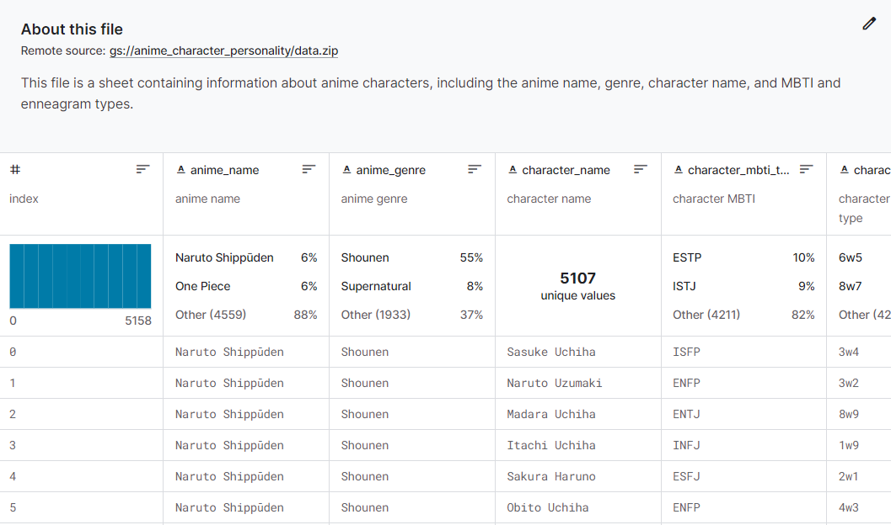

[Kaggle Dataset](https://www.kaggle.com/datasets/tianyimasf/anime-characters)

I'm broadly interested in the MBTI personality framework, and I also love anime.

Once I was searching for the personality type of my favorite anime character, and I noticed that there might be a relationship between how an anime character looks v.s. what their personality types is.

This is a fairly niche topic, and there doesn’t seem to be any existing dataset for it.

To investigate this, I scraped data from the personality database website(https://www.personality-database.com/top-story/8), and saved the character avatar in an image folder with subfolders corresponding to each anime.

In the data table, there are fields for anime name, genre, character name, MBTI and enneagram types.

For those who don't know what MBTI is, here is [a great diagram](https://raw.githubusercontent.com/tianyimasf/tidy-tuesday-social-dataset-analysis/main/mbti%20ex.PNG) that illustrate what it is.

And [this website](https://www.enneagraminstitute.com/type-descriptions) has concise descriptions of each of the 9 enneagram types.

Using this dataset, one can train a facial attributes detector to extract attributes like hair color, eye color, eye wear, facial hair, and so on. This is what I'll target next.

On the other hand, you can also just train it as a classical image classification task.

One might also consider just use this to analyze popular types in anime.

Maybe someone'll be interested in using my dataset, and if so, happy coding 👩‍💻
