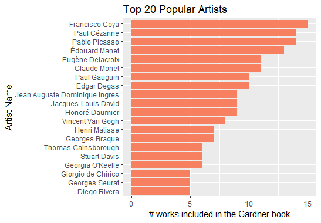
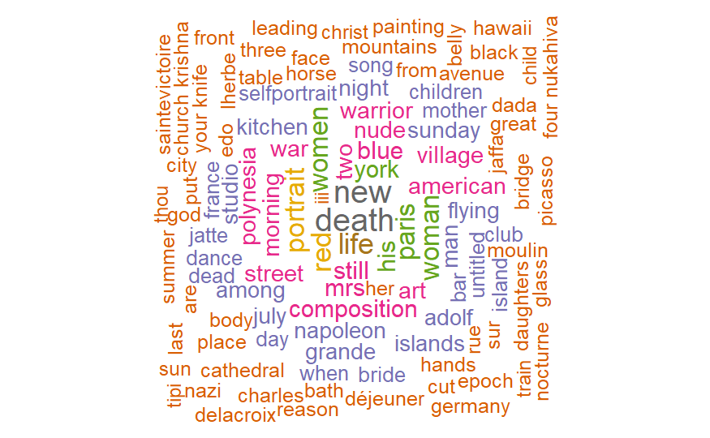
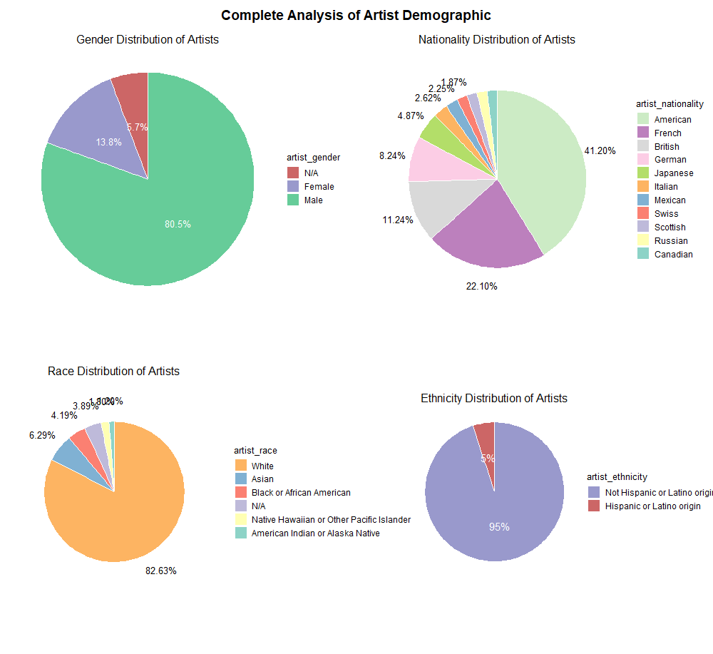

# A Tidy Tuesday Series: Art History Data Storytelling

Tidy Tuesday a wonderful weekly data project in R. They have been running since 2018, releasing a "toy" dataset every Tuesday for the R community to practice data wrangling and visualization. They have super fun datasets, and I'm using them to create this series, documenting my data storytelling journey and hopefully have fun too.

About this very first project: in high school I took AP Art History. Although I only got a 3 out of 5 in the exam, which is one of my worst scores, I loved the subject since I get to look at a sea of artworks. This is why I chose this dataset, as a reminiscence of my high school memory. I'm using R and various R libraries, such as dplyr, tidyverse, and ggplot2. I hope to learn more and more techniques and methods along the way.

In this notebook, I first analyzed the top 20 artists. Then I conducted a complete artist demographic analysis, using pie charts to visualize each attributes, such as gender, race, nationality, and ethnicity.

[Github](https://github.com/tianyimasf/tidy-tuesday-social-dataset-analysis/blob/main/art_history_analysis/image/complete_demographic_analysis.png)
