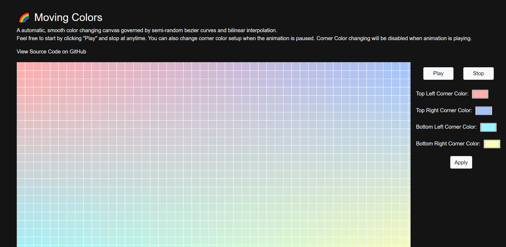

# Moving Colors

Colors, in first glance, seem to be a visual trait. However, it's computational representations are 3 numbers, each correspond with the amount of red, blue and green in one color. As a result, it's possible to apply mathematical functions to colors, and observe its effects.

This app is an automatic, smooth color changing canvas governed by semi-random bezier curves and bilinear interpolation. The bilinear interpolation helps to "merge" the four different colors in each corner. Hoever, the application of beizier curves are not that straightforward.

The Beizer curve is a special kind of curve that takes in four points -- the starting and ending point and two points in between as parameters to produce a smooth curve. 3D Beizer curves are periodically generated and applied to guide the change of corner colors. However, special computational care is taken to make sure that the curve on the connection point, e.g. the starting and ending points of the previous and next curve is smooth. Secondly, we only change two of the three color parameters(RGB) to make sure the color doesn't change in a dramatic way, and swap what those two parameters are every time a new Beizer curve is applied. Finally, a minimum limit is put on how much the color can change so that it does change a good amount.

This carefully crafted algorithm based on mathemcatical concepts produces what you can see in the website.

[Website](https://tianyimasf.github.io/color-gradients) | [demo video](https://www.loom.com/share/32fc878ea18244a1b49478aae04f736c)
