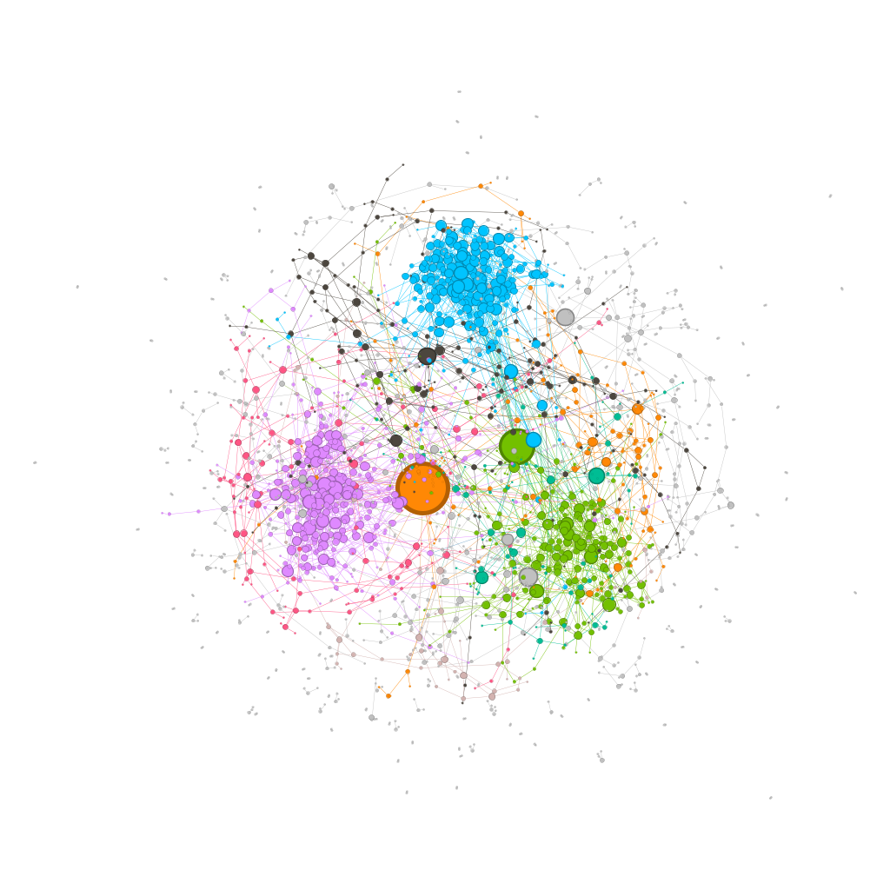
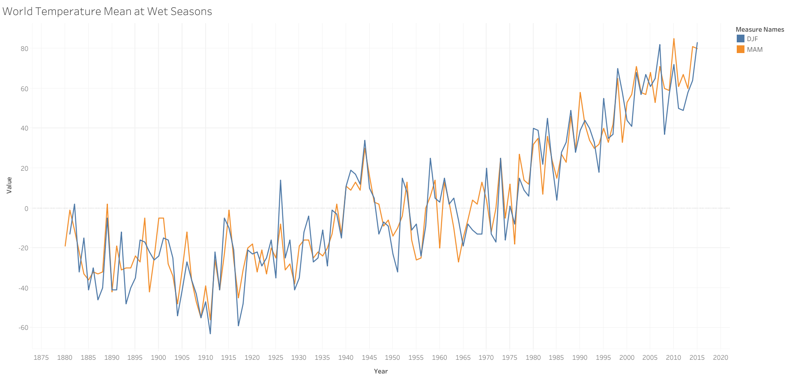
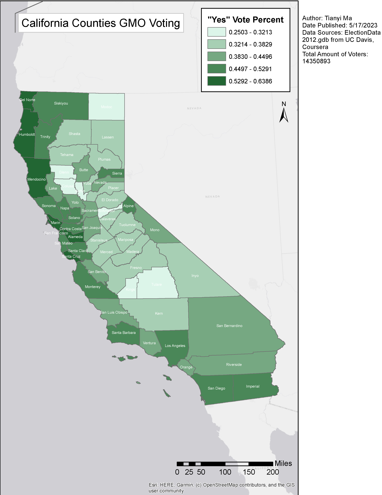
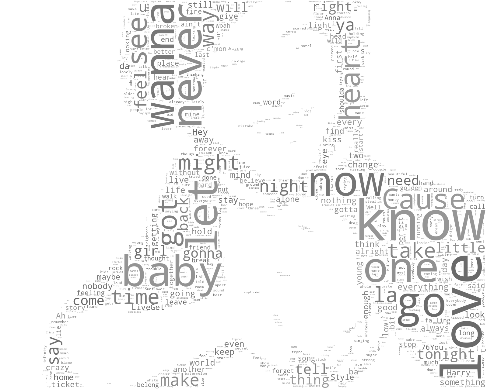

# Tableau, ArcGIS & Wordcloud Visualizations

Data is abundant in this era of Big Data. Visualizing the data provide special insights into the interaction between data points and characteristics of the dataset. It's a useful tool to gain knowledge of the data at hand, and good visualization do so even more.

The above is FB social network visualizations for 3000 anonymous users, created using Tableau.

This is a time series visualization of world temperature mean at wet seasons(DJF, MAM) from 1880 to 2015, created using Tableau.

Through the GIS course from US Davis on Coursera, I made my first map using ArcGIS.

A map plotting the percentages of yes votes for each California county for the ballot measure that requires Genetically Modified Organism labeling.

Scrapped Harry Style's most popular songs, extracted words in the lyrics and created wordcloud from them.
