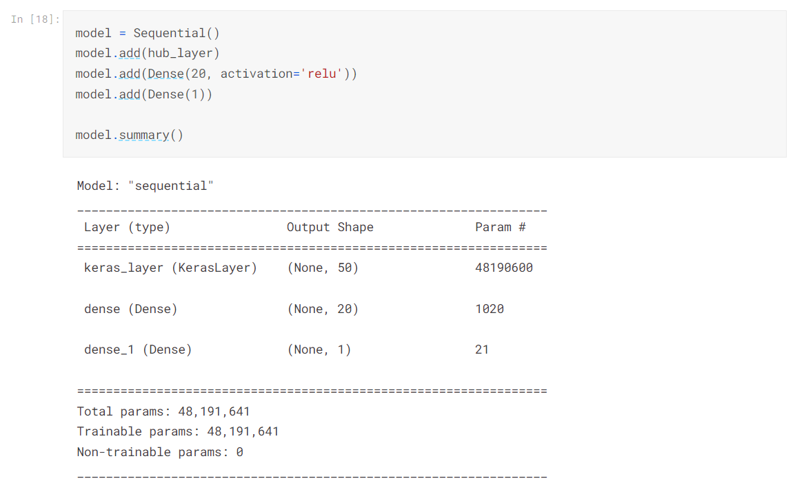

# Real Disaster Tweets Prediction

Twitter has become an important communication channel in times of emergency.

The ubiquitousness of smartphones enables people to announce an emergency they’re observing in real-time. Because of this, more agencies are interested in programatically monitoring Twitter (i.e. disaster relief organizations and news agencies).

But, it’s not always clear whether a person’s words are actually announcing a disaster. Take this example:

The author explicitly uses the word “ABLAZE” but means it metaphorically. This is clear to a human right away, especially with the visual aid. But it’s less clear to a machine.

In this competition, we’re challenged to build a machine learning model that predicts which Tweets are about real disasters and which one’s aren’t.

Using the Transformer encoder model, I initially acheived a 0.75758 accuracy. Upon fine-tuning, the accuracy is improved to 0.78577.

I also wrote a tutorial on multi-headed mechanism and also my Python code solving this that trains and predict using Transformer [my solution, part 1](/blog/real-disaster-tweets), [part 2](/blog/real-disaster-tweets-part-2) to this problem.

[Kaggle](https://www.kaggle.com/code/tianyimasf/real-disaster-tweets-prediction-with-transformer) | [Github](https://github.com/tianyimasf/kaggle/blob/main/real-disaster-tweets-prediction-with-transformer.ipynb)
