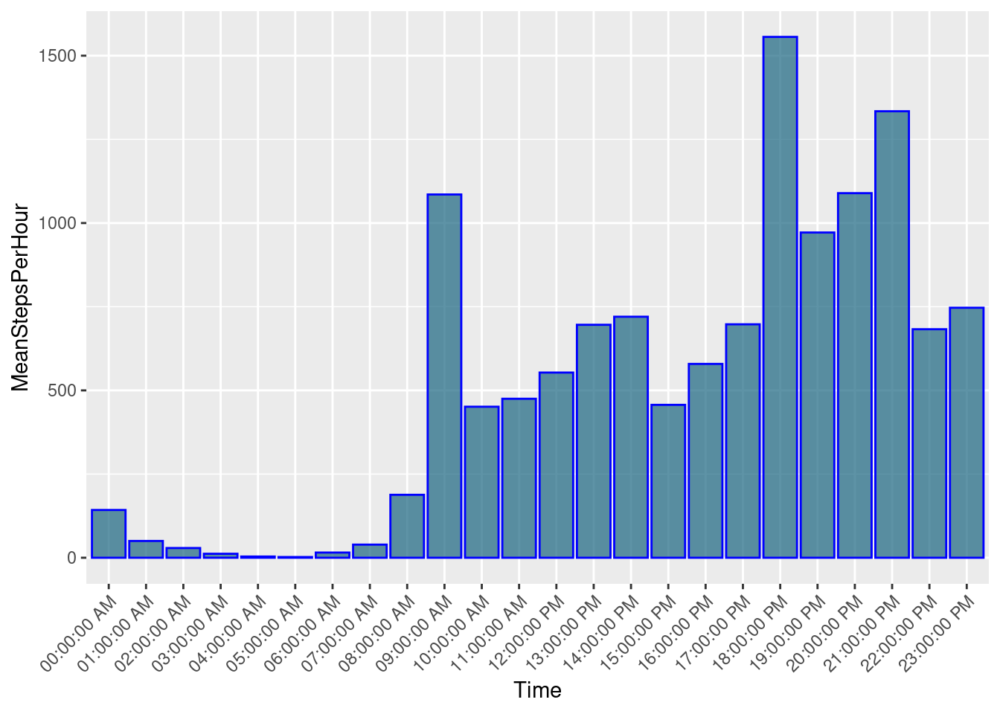
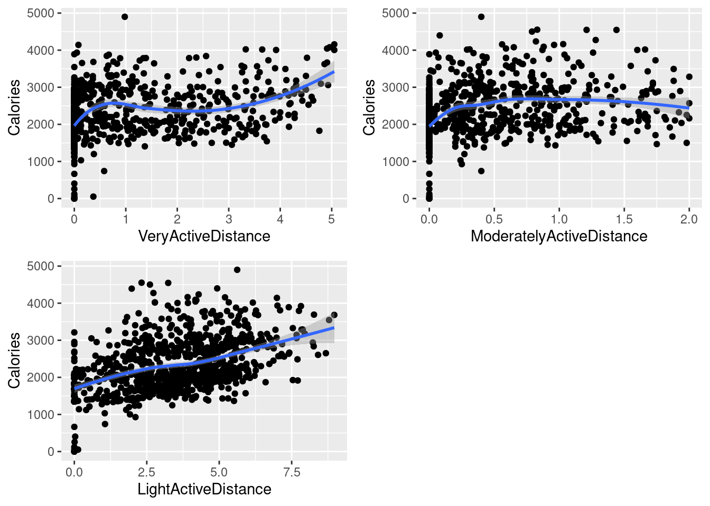

# What to expect in this blog

This is going to be a slightly technical blog, just because it'll focus on the techniques I used to analyze the dataset and extract relationships and insights. There won't be any math, though, only numbers produced by a technique, what the technique does, what the numbers mean, and what's the code for it. The code is usually one-liners since R is just that cool (? jk. or am I? :p)

I thought it would be useful to just boom boom boom, get a ton of helpful techniques out there, for reference purposes. So here we go.

[Complete R Notebook for reference](https://www.kaggle.com/code/tianyimasf/fitbit-usage-trend-analysis-viz-regression)

# Exploratory Analysis

Not a lot to see here. Of course, first of all load tidyverse.

A list of common functions and short descriptions:

- head(): to see the complete first 5 rows of the dataframe, no matter how many columns there are.
- colnames(): as the function name suggests, return a list of column names in the dataframe.
- n_distinct(column): return the number of distinct values for a column. Doesn't return what they are and their counts.
- nrow(): return the number of rows a dataframe has.

# Data cleaning

I removed outliers since they skewed the distribution and would distablize analysis even if they are real values.

R doesn't seem to have a function to do this, so I wrote my own:

```{r}
filter_outlier <- function(data, column){
  quartiles <- quantile(column, probs=c(.25, .75), na.rm = FALSE)
  IQR <- IQR(column)

  Lower <- quartiles[1] - 1.5*IQR
  Upper <- quartiles[2] + 1.5*IQR

  data_no_outlier <- subset(data, column < Upper)
  return(data_no_outlier)
}
```

The function returns a dataframe without the outliers, but you can also return the outliers by setting `column > Upper` in the second to last line. You might want to rename `data_no_outlier` to something like `outeliers`.

As you see, the function calculate Q1 and Q3 of the data. The lower bound is obtained by minus Q1 with $1.5 \times IQR$, and the upper bounds add $1.5 \times IQR$ to Q3. The reason behind this is that calculated this way, the upper and lower bound is approximately $\displaystyle \pm 2.7 \times std$, which is close to 3 standard deiviation from the center mean.

# Data Analysis with Visualizations

My next step is to analyze the relationship between distance with various intensities and calories burnt. I did this by using scatter plot on each of the intensities data.

One line of code looks like this:

```{r}
p1 <- ggplot(data=very_active_distance, aes(x=VeryActiveDistance, y=Calories)) + geom_point() + geom_smooth()
```

Let's break down this one-liner.

- ggplot() initialize a ggplot object.
  - According to the official doc, "it can be used to declare the input data frame for a graphic and to specify the set of plot aesthetics."
  - The first half of the sentence is clear enough -- it specifies which dataframe to use for this graph.
  - The second half of the sentence requires us know what the heck "aesthetics" mean here.
  - It means "something you can see", so here we can specify x = ..., y = ..., color = ..., and so on.
  - Each aesthetic will be initialized with a name value pair where the value is a layer variable, which means you directly refer to the column name instead of referring to the dataframe
- geom_point() specifies that this would be a scatter plot
- geom_smooth() will add the correlation line over the scatter plot, with a grey area around the line to indicate the data point variance.

Before I show you the final plot, bare with me to see how you can create subplots and combine them.

First we install and load a package called "gridExtra".

```{r}
install.packages("gridExtra")
library("gridExtra") # double quote is not necessary here
```

Then we create two other plots using the same code as before, only replace the variables, and call them `p2` and `p3`.

```{r}
p2 <- ggplot(data=moderately_active_distance, aes(x=ModeratelyActiveDistance, y=Calories)) + geom_point() + geom_smooth()
p3 <- ggplot(data=light_active_distance, aes(x=LightActiveDistance, y=Calories)) + geom_point() + geom_smooth()
```

using the grid.arrange() function, we can create a subplot, specifying that we want 2 rows of subplots:

```{r}
grid.arrange(p1, p2, p3, nrow = 2)
```

We get the following subplot:



We can see that VeryActiveDistance and LightActiveDistance have generally positive correlation with calories, while ModeratelyActiveDistance has none or slightly negative correlation with calories.

Applying the same functions to minutes with various intensities, we get the following graphs:


It looks like VeryActiveMinutes have a positive correlation with calories burnt. The other two has insignificant correlations.

I also plotted Total Steps and Total Distance's correlation with calories burnt, and the result is not surprising -- they clearly correlates positively.

# Multivariate Regression Analysis

This is a great yet basic statistical technique to actually quantify the relationships between independent variables("predictors", "explanatory") and dependent("target") variable.

A simpler version of this is univariate regression analysis. This means it's only considering one independent variable.

If you remember from high school, a degree 1 polynomial with one variable is the simpliest form of polynomial. In math language, it can be simply expressed as follow:

$$ y = ax + b $$

where y is the target variable and x is the independent variable. What it's saying is that a change in 1 unit of the independent variable $x$, will result in a change of $a$ times a unit of the target variable $y$, with a bias term of $b$.

Wait, why do we need the bias term?

It offsets the model. With only the parameter a, we are assuming that, for example, if the independednt variable is 0, then the target variable is also 0. That doesn't make sense. I can still burn calories if I lay in bed all day.

This is why we need the bias term b, which offsets the straight line of $y = ax$. This is effectively saying, no matter what the independent variable is, there are something constant other than $x$ that contribute to the value of $y$.

A univariate linear regression model effectively models the effects of one independent variable. In reality, we would want to model multiple variables. So we use multivariate regression.

The math formula of this is similar to the univariate version, only we are just adding more variables to the equation:

$$ y = a_1x_1 + a_2x_2 + ... + a_nx_n + b$$

where n is the number of variables you want to model.

This model is effectively telling us: if you only varies x_i, where x_i is the $i$th independent variable, and keep every other variables the same, then the target variable $y$ will change a_i times one unit of the target variable, offset by the bias term b.

It's just a level up of the univariate version! But more granular.

And you can also calculate scores based on your model to see how well your model "models" the variance in your target variable($R^2$), and also if your model gives you significant signals instead of just random noise($p$-value).

Now we can apply what we know about regression analysis to the tracker data.


