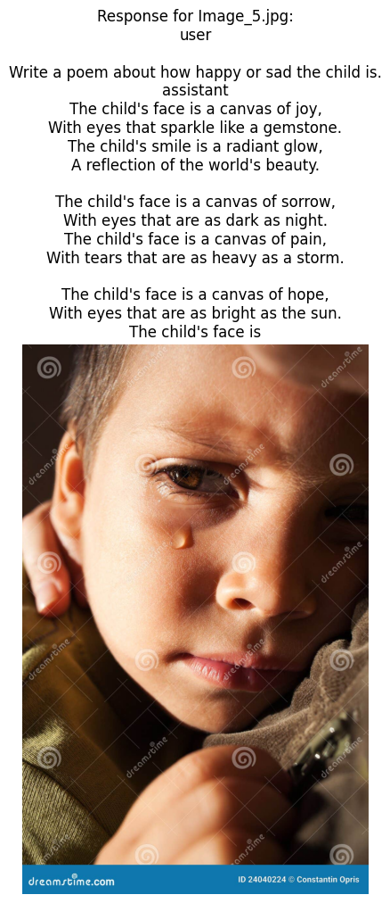
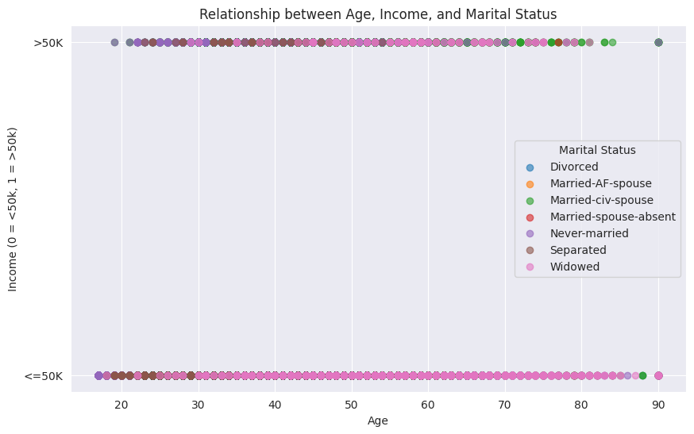
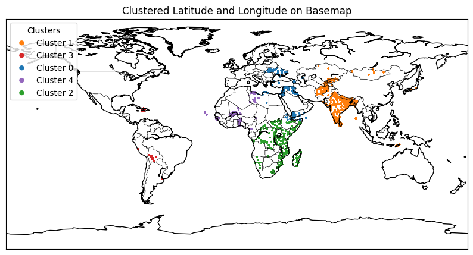
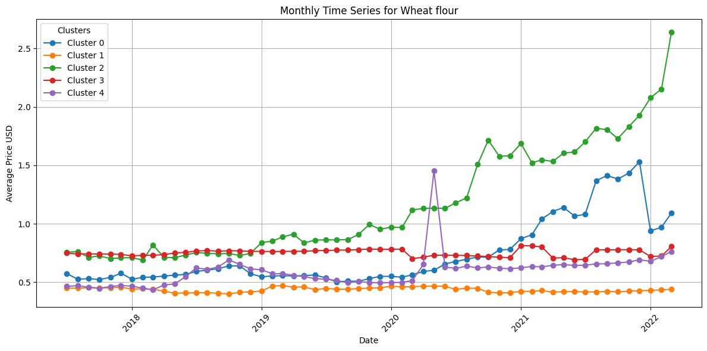
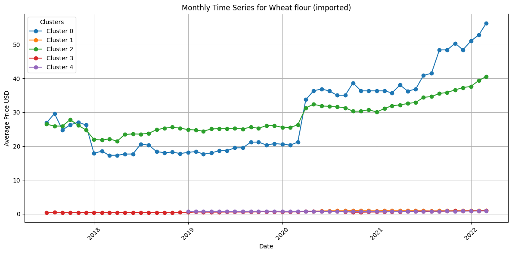
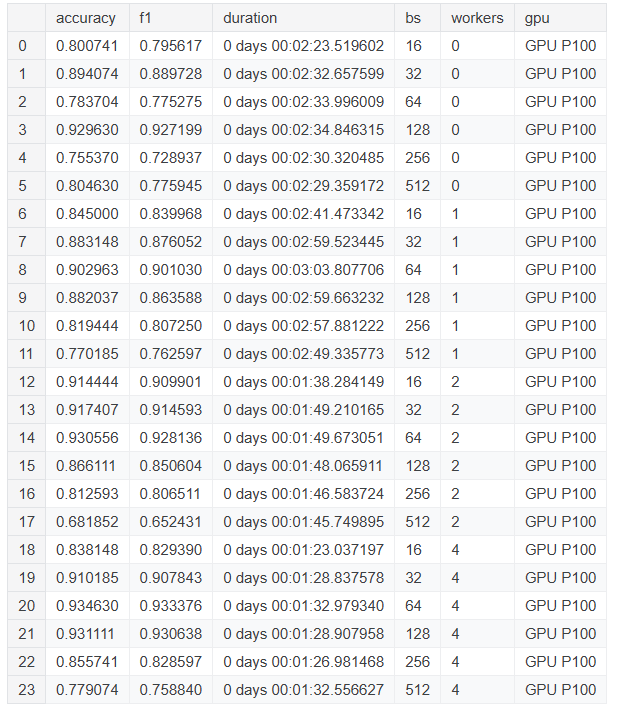
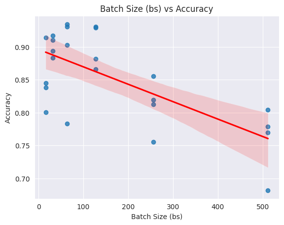
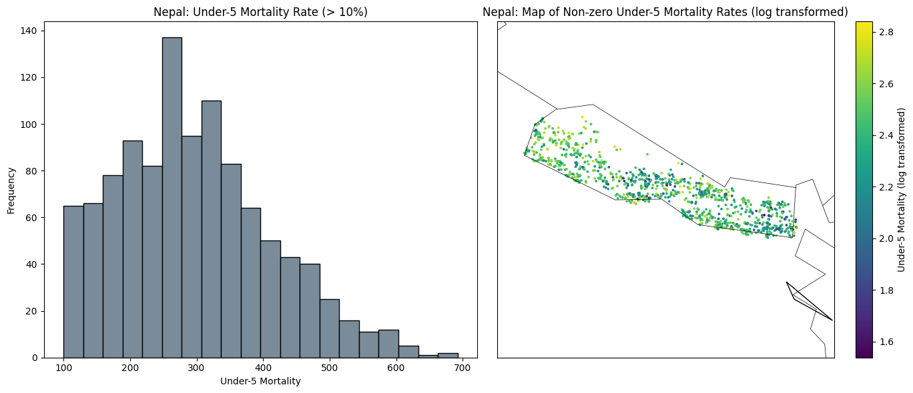
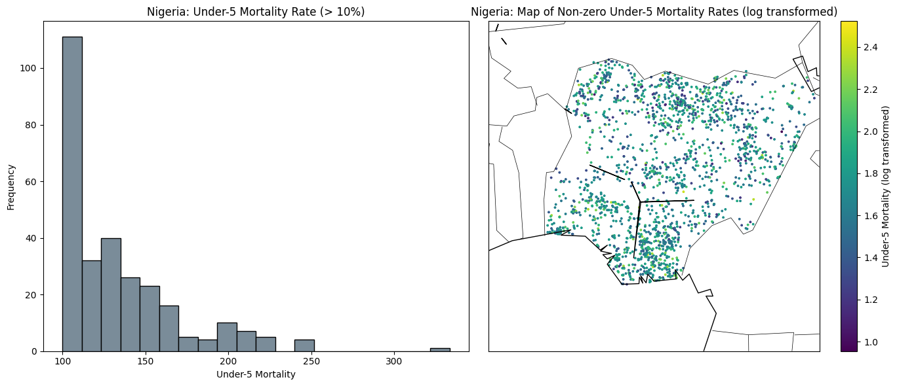
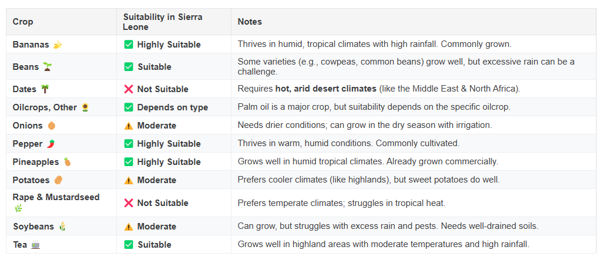

# Data Science Projects

---

Some poem:

---

## Projects

### Income Classification MLP (*All code starts at 'Submission')

[Kaggle](https://www.kaggle.com/code/tianyimasf/mlp-alex-ma#Submission)

Most widow earns less than $50k/year.

---

### Wheat Price Shock Forecast during Russian-Ukraine War

[Kaggle](https://www.kaggle.com/code/tianyimasf/wheat-price-shock-forecast)

---

### GeoML: EuroSAT Land Cover Classification using CNN

[Kaggle](https://www.kaggle.com/code/tianyimasf/geoml-land-cover-cnn-classification)

Grid search experiments for runtime v.s. accuracy trade-off.

---

### Pulling & Visualizing Wealth & Poverty Data

[Kaggle](https://www.kaggle.com/code/tianyimasf/pulling-visualizing-wealth-poverty-data)

---

### Collaborative Filtering for Agricultural Commodities

[Kaggle](https://www.kaggle.com/code/tianyimasf/collaborative-filtering-agricultural-commoditites)

Recommending crops for African countries.

---

### Predicting Wealth & Poverty with SatCLIP

[Kaggle](https://www.kaggle.com/code/tianyimasf/predicting-wealth-poverty-with-satclip)

Satellite embeddings as input features. 

---

### Autoencoders for Climate Embeddings

[Kaggle](https://www.kaggle.com/code/tianyimasf/autoencoders-for-climate-embeddings)

Explore climate embeddings: finding future locations (purple) with similar climate to current location (green blue). 

