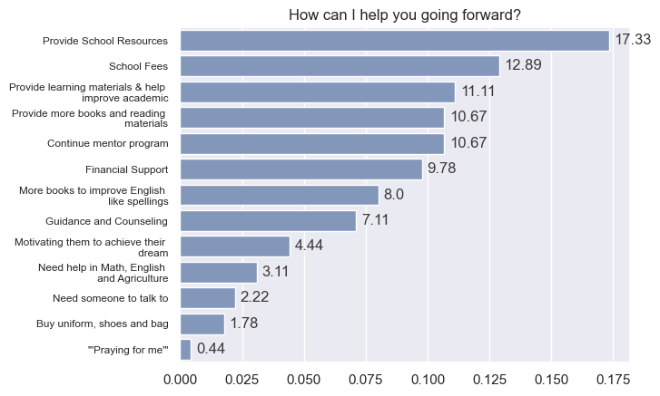

# Alex's Homepage

## Hi there 👋, I'm alex. 

Methodical applied mathematician and seasoned programmer with extensive experience in optimization research and end-to-end business process improvements and developments. Starting from undergraduate research and post-graduate software engineering at an AI startup, I pivoted to working on building sustainability and power grid optimization with future interests in similar fields in addition to data-driven environmental anthropology.

---

## Projects

**Microgrid Design Assistant**: A flexibale and fast Python program using cvxpy to optimize for costs of DER (Distributed Energy Resources) and microgrid autonomy and resiliency for a given load demand profile and target renewable resource unit. [Code](notebooks/microgrid-dev.html) [Paper](https://drive.google.com/file/d/1_ewfbdYHzW9uIgzbXxjGDslFlMExmi1N/view?usp=sharing) [Github](https://github.com/tianyimasf/microgrid-design-assistant)

**Electricity Impact of a Typical Single-Family Home in Delhi**: A data-driven report on the mentioned topic after conducting the background and literature research. [Report](https://drive.google.com/file/d/1CwOXd4A1G-ywm68rSRB1-0W4NzBqG49n/view?usp=sharing)

**Educational Program Outcome Analysis**: Used numerical processing libriaries Pandas and numpy, machine learning libraries scikit-learn and its model kMeans clustering, language processing libaries nltk, gensim, and sentence_transformer and plotting libraries matplotlib and seaborn, converted student result surveys to numerical representations and then found latent clusters representing topics mentioned in the surveys. Surfaced specific familial, mental and material issues students are facing and improved on some previous general problem classifications. Furthermore, analyzed grade level, graduation obstacle and family status’s impact on attendance rates. 

---

## Education

**M.S. in Applied Mathematics, Data Science and Statistics Track**  
_University of Colorado, Boulder (graduating 2026)_ 

**B.S. in Mathematics, Minor in Computer Science**  
_University of Rochester_  

---

##  Work Experiences

**Environmental Data Analyst Intern @ Mercy Housing, Green Hope Team**    
_September 2024 - Present (4 months)_
Using data analysis to support reducing water and electricity usage.

**Research Assistant @ Prof. Daniel Acuña Science of Science Lab, CU Boulder**  
_June 2023 – October 2023 (4 months)_

Investigated racial and gender biases in generative AI models by generating images for people descriptions in English and Chinese across gender, occupation and social contexts. Analyzed and compared the classification result statistics to real world census data and discovered that the models almost uniformly amplified existing biases in the real world drastically. Detailed the data preparation process, algorithmic differences in chosen models and findings in a research paper.

**Software Engineer**  
_April 2022 - March 2023 (1 year)_

Provided an accurate, consistent and easily-interpretable new process that replaced the overly complicated old manual process of configuring task pricing schemes that’s prone to error. As a result of the payout consistency, the number of payout debugging tickets for the target tasker types are reduced to close to 0 and overall tasker payout cost is reduced 35%.

---

##  Skills

- **Programming Languages**: (Fluent) Python, TypeScript, (Intermediate) R, SQL, C/C++ 
- **Libraries**: pandas, numpy, scikit-learn, Pytorch, scipy, matplotlib, seaborn
- **Version Control**: Git
- **Software**: LATEX, Office Suite (Excel, Word, PowerPoint), Looker Studio
- **Languages**: Mandarin (native), English (bilingual) 
- **Interests**: Gaming, Reading, Photography and Beauty

---

## Fun Stuff

- I keep 3 cats with my husband. Their name is Butter, River, and Smudge. 

- I lived in Beijing, China until 18 and came to America. My high school is 20 min walk away from the Ti'anmen Square.

- I have my mom's surname.

---

##  Contact

* Email: <a href="mailto:alex.ma@colorado.edu">Alex's email</a>
* GitHub: [@tianyimasf](https://github.com/tianyimasf)
* <a href="https://www.linkedin.com/in/alex-tianyi-ma/">LinkedIn</a>

