# Data Science Projects

---

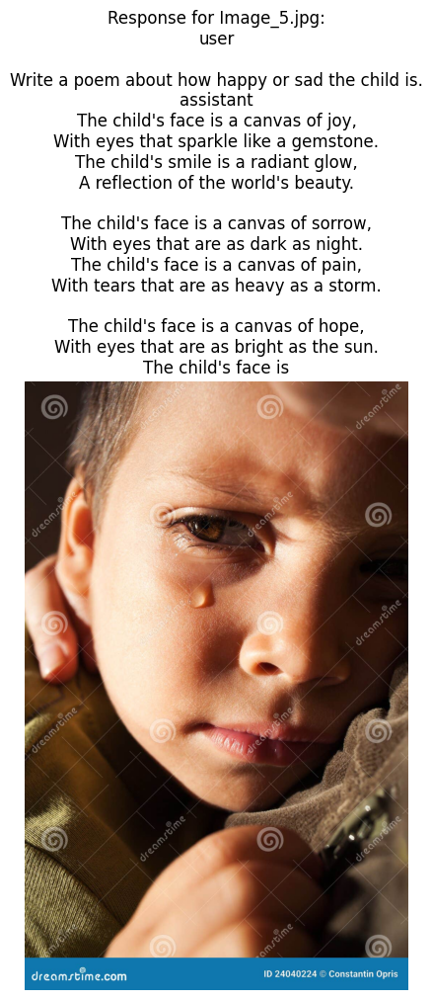

---

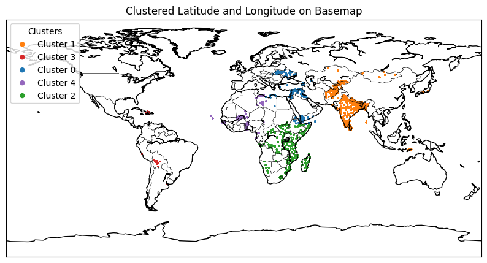
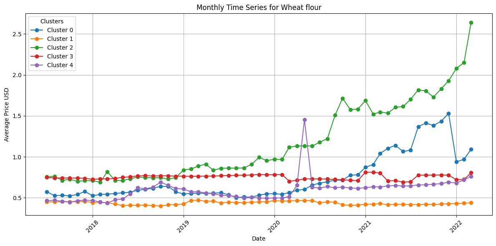
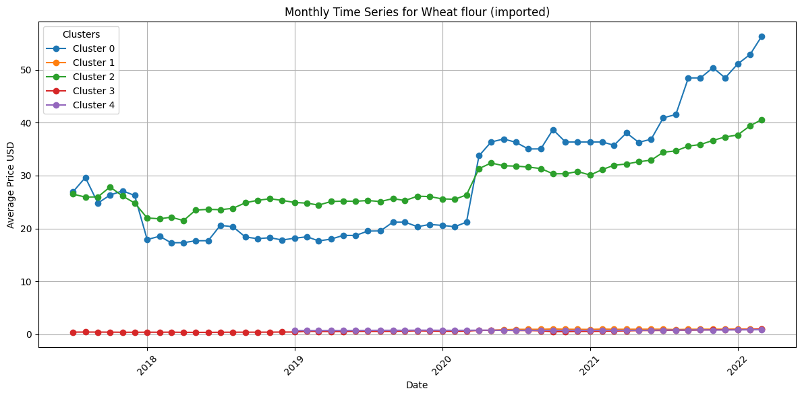

### Wheat Price Shock Forecast during Russian-Ukraine War

[Kaggle](https://www.kaggle.com/code/tianyimasf/wheat-price-shock-forecast)

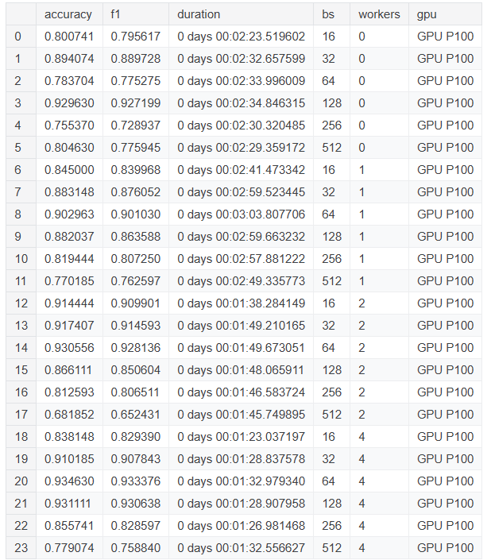
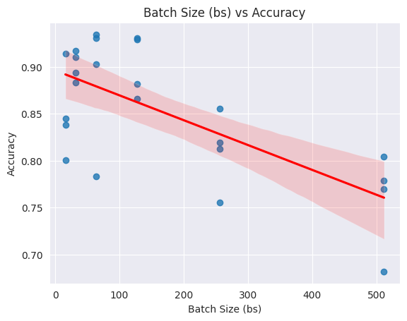

### GeoML: EuroSAT Land Cover Classification using CNN

[Kaggle](https://www.kaggle.com/code/tianyimasf/geoml-land-cover-cnn-classification)

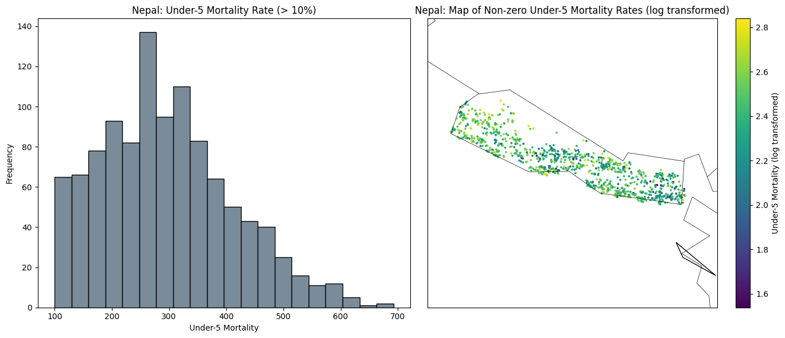
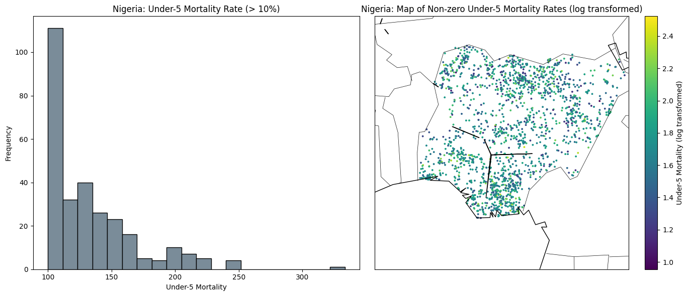

### Pulling & Visualizing Wealth & Poverty Data

[Kaggle](https://www.kaggle.com/code/tianyimasf/pulling-visualizing-wealth-poverty-data)

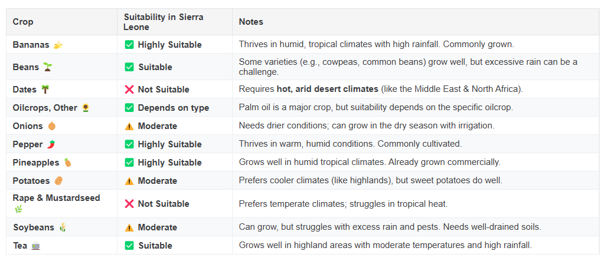

### Collaborative Filtering for Agricultural Commodities

[Kaggle](https://www.kaggle.com/code/tianyimasf/collaborative-filtering-agricultural-commoditites)

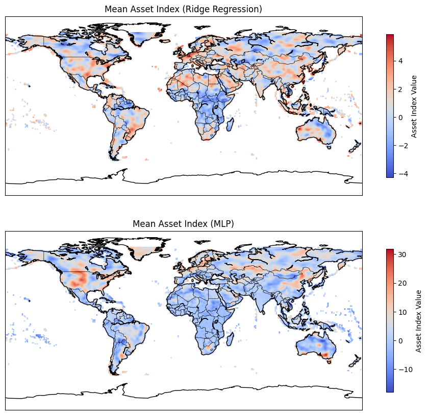

### Predicting Wealth & Poverty with SatCLIP

[Kaggle](https://www.kaggle.com/code/tianyimasf/predicting-wealth-poverty-with-satclip)

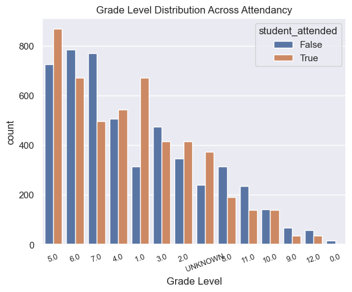

### Income Classification MLP (*All code starts at 'Submission')

[Kaggle](https://www.kaggle.com/code/tianyimasf/mlp-alex-ma#Submission)

### Autoencoders for Climate Embeddings

[Kaggle](https://www.kaggle.com/code/tianyimasf/autoencoders-for-climate-embeddings)
