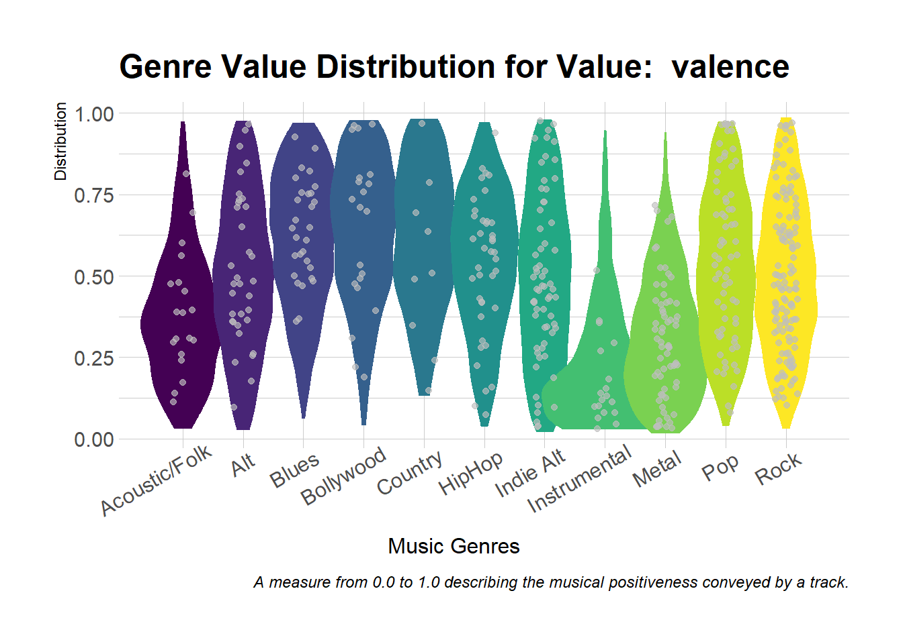
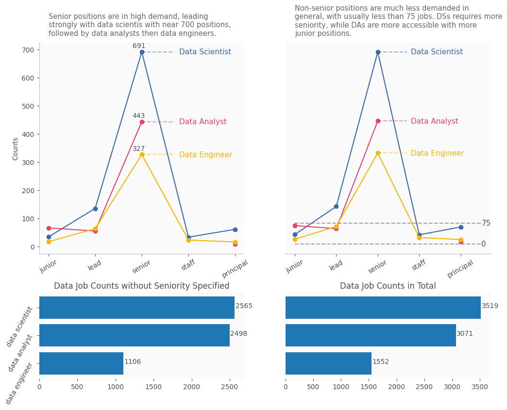

# Projects

---

## Music Genre Feature Analysis

- [Excel data wrangling and analysis](https://o365coloradoedu-my.sharepoint.com/:x:/g/personal/tima2081_colorado_edu/ETp3FcxWa7NJnnsVF0n8s_0BG-CS2T7Gi3dRbzqsFAvc_g?e=SorLrq)

- [Exploratory data analysis and vizualization R Notebook](/notebooks/feature-analysis-in-R.html)

- [Github](https://github.com/tianyimasf/music-genre-analysis)

---

## Mentorship Program Attendance Analysis

- [Python Analysis Script](https://colab.research.google.com/drive/1JC4JylzkV3HPu6bDFp60Wwd3ITfi9gYr?usp=sharing)

- [Written Report & Viz](https://docs.google.com/document/d/1nHmsxaV5x8rwXcEXnrNi6lCodwLy2TukxNCoUNGT5nY/edit?usp=sharing)

---

## LinkedIn Job Postings Analysis

- [Data Cleaning and Transformation](https://tianyimasf.github.io/ai/data-cleaning/)

- [Data Visualization and Presentation](https://tianyimasf.github.io/ai/job-title-analyze/)

- [Kaggle Notebook](https://www.kaggle.com/code/tianyimasf/linkedin-job-postings-data-prep)

